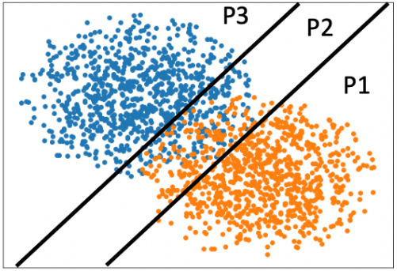
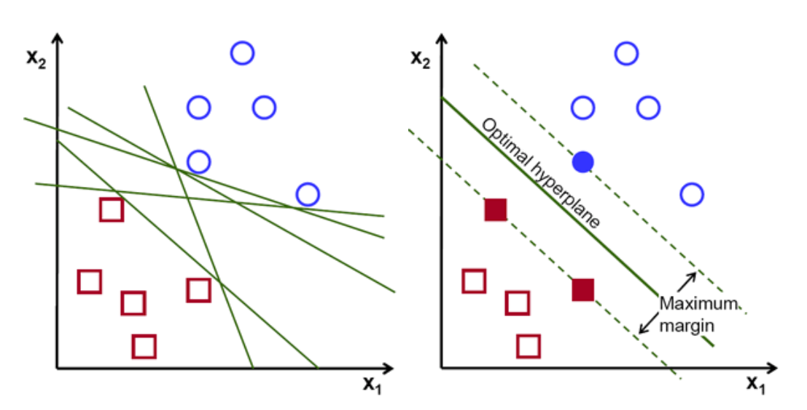

# Designing Hard SVM Classifier using Convex Optimization
The main goal in this project is to correctly classify data from two classes: 1 and -1 without using already built sklearn library.
There are two main challenges that are associated with this project:

1. Build a classifier using convex optimization (sklearn not allowed).

If we are allowed to use sklearn to build the classifier, the code is as simple as:
```Python
from sklearn.svm import SVC
model = SVC(probability = True)
svm.fit(train_data,train_label)
```
With the built-in library _SVC_, we cannot know what calculations are made when fitting the data. To truly understand the algorithm behind it, we will use convex optimization to build the classifier.

2. Assume there is a cost associated with each data point used for training. The minimal number of data points that are transmitted is desired. 

<p align="center">
  
</p>

There are data points that are more useful than others in designing the classifier. In the picture above, the data points in P1 and P3 would be less useful than the points in P2.

# Part 1. Synthetic Data

Data for two classes are created through a Gaussian distribution. The center of each class 1 and -1 will be located at (-1,1) and (1,-1), respectively.

```Python
class rand2DGaussian:
  def __init__(self):
    self.data = []
    self.label = []

  def add_data(self, classifier):
    self.label.append(classifier)
    if classifier == 1: #mean (-1, 1)
      self.data.append([np.random.normal(-1,1),np.random.normal(1,1)])
    elif classifier == -1: #mean (1,-1)
      self.data.append([np.random.normal(1,1),np.random.normal(-1,1)])

#generate n random data points using add_data with labels -1 or 1
  def generate_data(self, n):
    for i in range(n):
      self.add_data(rnd.choice([-1,1]))
      
synthetic_data = rand2DGaussian()
synthetic_data.generate_data(12000)
```

# Part 2. Covex Optimization

There are many possible hyperplanes that can be drawn to separate two classes. To enhance the accuracy of the classifier, it is also important to have the hyperplane as far as it is possible from the data points. 
This optimal hyperplane will have the maximum margin.


The hyperplane that classifies two classes is defined to be:


The main goal is to update _w_ and _gamma_ to minimize the following loss function:


<p align="center">
  
</p>

In order to find the optimal classifier, we need to maximize the margin and the maximum margin can be obtained by:


Thus, the additional regularizer term is added to the loss function:


```Python
import cvxpy as cp

# Convex Optimization - Define loss function
Weights = cp.Variable((len(train_sample_data),1))
gamma = cp.Variable()
loss = cp.sum(cp.pos(1 - cp.multiply(self.selected_train_labels, self.selected_train_data @ Weights + gamma)))
c = cp.norm(Weights, 1)
slack = cp.Parameter(nonneg=True, value = self.regulizer)
               
prob = cp.Problem(cp.Minimize(loss/len(self.selected_train_data) + c*slack))
prob.solve()

# Results
self.w = Weights.value.flatten()
margin = 1/np.linalg.norm(self.w)
self.intercept = gamma.value
```

# Part 3: Data Selection

Since there is a cost associated with each data point used to training, only the data within the margin are selected to train the model.

```Python
def sample_selection(self, training_sample):
# ... #
  if(self.toggle_var==train_sample_label):
    if(isBetweenHyperplanes(train_sample_data, self.w, self.intercept, self.b_neg) and train_sample_label == -1):
      self.selected_train_data.append(train_sample_data)
      self.selected_train_labels.append(train_sample_label)
      self.new_sample_added = True
      self.toggle_var = -train_sample_label
    if(isBetweenHyperplanes(train_sample_data, self.w, self.intercept, self.b_pos) and train_sample_label == 1):
      self.selected_train_data.append(train_sample_data)
      self.selected_train_labels.append(train_sample_label)
      self.new_sample_added = True
      self.toggle_var = -train_sample_label
```
The toggle_var improves the accuracy of the classfier by guaranteeing our model to have equal number of class 1 and -1 used to train the model.
Also, the selected_train_data and label are appended only when the data is between the margin (checked through isBetweenHyperplanes).

With the efficient data selection, only 1 to 2% data is used to train and the accuracy of the classifier was approximately 91 to 93%

